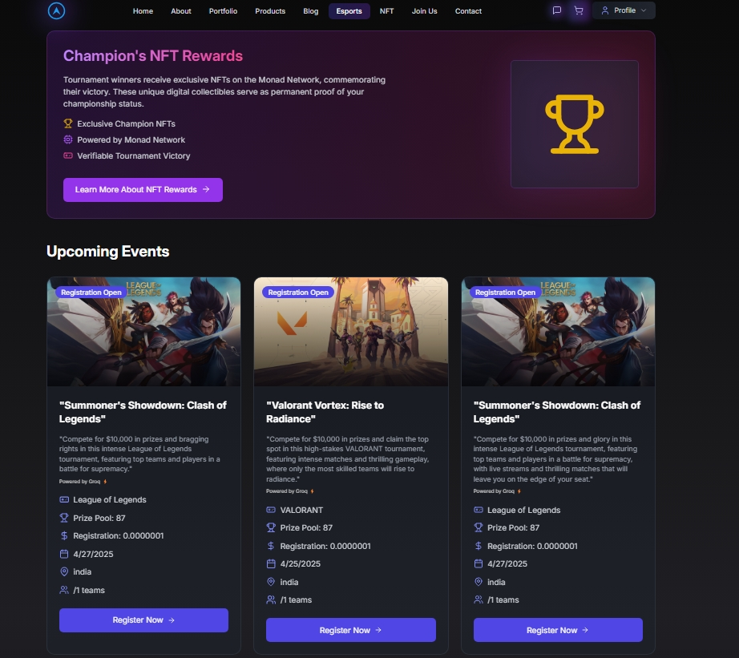
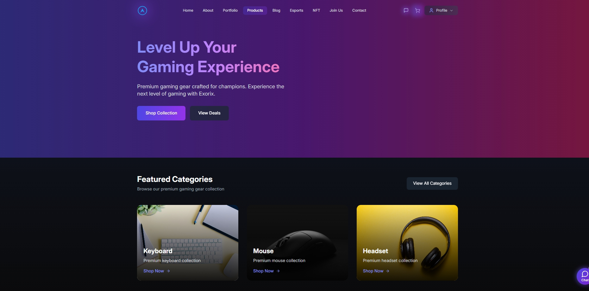
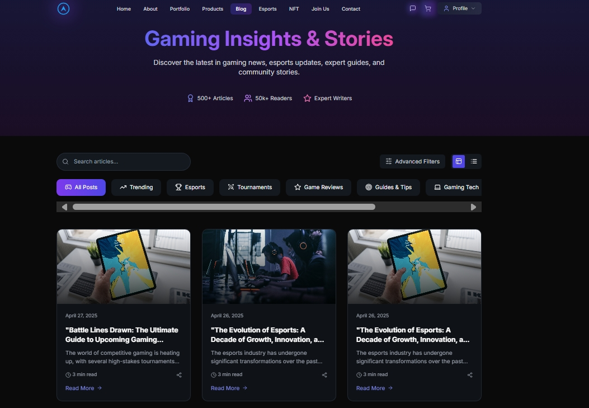
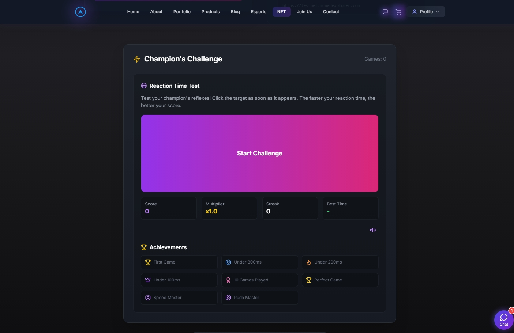

# 🚀 Exorix

> An AI-powered esports platform revolutionizing the gaming experience with advanced features and seamless integration.


---

## 📌 Problem Statement

**Problem Statement 1 – Weave AI magic with Groq**

**Problem Statement 2 – Unleash Blockchain with Monad**

**Problem Statement 4 – Craft the future for Onchain Consumer Experience with base**

---

## 🎯 Objective

Exorix revolutionizes the esports and gaming landscape by creating an all-in-one platform that seamlessly integrates competitive gaming, community engagement, and digital commerce. Our platform serves as a comprehensive ecosystem for:

- **Gamers & Enthusiasts**: Offering AI-powered gaming assistance, real-time community chat, and access to premium gaming products
- **Tournament Organizers**: Providing advanced tournament management tools, live streaming capabilities, and NFT-based prize distribution
- **Content Creators**: Enabling AI-assisted blog creation, multi-language support, and seamless content sharing
- **Esports Teams**: Facilitating team management, match coordination, and performance tracking
- **Gaming Communities**: Fostering engagement through interactive features, voice chat, and real-time updates

By leveraging cutting-edge technologies like Groq AI, Base blockchain, and Monad NFTs, we're creating a next-generation gaming platform that:
- Democratizes access to professional gaming tools and insights
- Rewards competitive achievements with tangible digital assets
- Breaks down language barriers in global gaming communities
- Provides a secure and seamless marketplace for gaming products
- Creates an immersive and interactive gaming experience

---

## 🧠 Team & Approach

### Team Name:  
`Exorix Team`

### Team Members:  
- Vishnu (GitHub: [Vishnu252005](https://github.com/Vishnu252005))

### Your Approach:  
- **Innovative Integration**: We've created a revolutionary gaming platform that seamlessly combines AI technology with competitive gaming, offering an unparalleled experience for both casual and professional gamers.

- **Key Features & Solutions**:
  - 🎮 **AI-Powered Gaming Assistant**: Our Groq-powered chatbot, using the llama-3.3-70b-versatile model, provides real-time gaming strategies, match predictions, and personalized recommendations, making it feel like having a professional coach by your side.
  - 🏆 **NFT Prize System**: Leveraging Monad blockchain, we've created a unique reward system where tournament winners receive exclusive NFTs as prizes, with IPFS-based metadata storage and smart contract-based distribution.
  - 💰 **Smart Wallet Integration**: Using Base technology with @coinbase/onchainkit, we've implemented secure and seamless transactions with smart wallet preference, making it easy for users to manage their gaming assets and rewards.
  - 🌐 **Multi-Language Support**: Our Groq-powered translation system breaks language barriers, allowing gamers worldwide to participate and communicate effectively, with support for multiple languages and dialects.
  - 🎯 **Advanced Tournament Management**: From bracket generation to match predictions, our platform uses Groq AI to create fair and exciting tournament experiences, with Monad-based prize distribution.
  - 🛍️ **Premium Gaming Marketplace**: A curated selection of high-end gaming products with secure checkout powered by Base smart wallet integration, ensuring safe and seamless transactions.
  - 📝 **Interactive Gaming Blog**: Groq-powered content generation for gaming news, reviews, and guides, with multi-language support and real-time updates.
  - 📺 **Live Streaming Integration**: Seamless integration with Twitch and YouTube for live tournaments, featuring real-time viewer counts, chat, and interactive elements.
  - 💬 **Community Chat Platform**: Real-time voice and text chat with game status integration, reactions, and community events, fostering a vibrant gaming community.

- **Breakthrough Innovations**:
  - First platform to combine AI match predictions with NFT rewards
  - Seamless integration of blockchain technology for secure transactions
  - Advanced AI-powered content generation for gaming strategies and guides
  - Real-time translation support for global gaming community
  - Smart contract-based reward distribution system
  - Integrated gaming marketplace with secure payment processing
  - AI-assisted blog creation with multi-language support
  - Live streaming platform with interactive features and real-time analytics
  - Advanced community chat system with voice integration and game status tracking

---

## 🛠️ Tech Stack

### Core Technologies Used:
- Frontend: React, TypeScript, TailwindCSS, Framer Motion
- Backend: Firebase, Node.js
- Database: Firestore
- APIs: Various gaming and payment APIs
- Hosting: Vercel

### Sponsor Technologies Used:
- ✅ **Groq:** 
  - AI-powered gaming assistant using llama-3.3-70b-versatile model
  - Real-time gaming strategies and match predictions
  - Multi-language support with advanced translation capabilities
  - Speech-to-text conversion for voice interactions
  - Content generation for gaming blog and guides
  - Tournament bracket generation and analysis
  - Interactive gaming chatbot for user assistance

- ✅ **Monad:** 
  - Testnet integration (chainId: 0x279f) for blockchain transactions
  - Native token (MON) support and management
  - Smart contract interactions for reward distribution
  - NFT prize system for tournament winners
  - IPFS integration for NFT metadata storage
  - Digital collectibles marketplace

- ✅ **Base:** 
  - Smart wallet integration using @coinbase/onchainkit
  - Secure transaction processing on Base Sepolia
  - Web3 authentication and wallet management
  - On-chain rewards and asset management
  - Checkout system for gaming marketplace
  - Enhanced security with smart wallet preference

---

## ✨ Key Features

- 🎮 **AI-Powered Gaming Assistant**
  - Real-time gaming strategies and match predictions
  - Multi-language support with Groq AI
  - Voice chat and speech-to-text capabilities
  - Interactive gaming tips and recommendations



- 🏆 **Tournament Management**
  - Professional tournament hosting and management
  - Custom tournament brackets
  - Live streaming integration with Twitch/YouTube
  - Real-time match scheduling and results tracking

- 💰 **Digital Marketplace**
  - Premium gaming products and accessories
  - Detailed product specifications and reviews
  - Secure checkout with Base integration
  - Real-time inventory management



- 📝 **Gaming Blog Platform**
  - AI-powered content generation
  - Multi-language support
  - Featured articles and trending posts
  - Interactive community engagement



- 📺 **Live Streaming Hub**
  - Seamless Twitch and YouTube integration
  - Real-time viewer counts and chat
  - Tournament highlights and replays
  - Professional production quality

- 💬 **Community Features**
  - Real-time voice and text chat
  - Game status integration
  - Community events and tournaments
  - Interactive reactions and engagement

- 🎯 **Tournament Features**
  - Prize pool management
  - Team registration system
  - Match scheduling and tracking
  - Professional tournament organization



- 🛍️ **Product Showcase**
  - High-end gaming peripherals
  - Detailed product specifications
  - Customer reviews and ratings
  - Secure payment processing

---

## 📽️ Demo & Deliverables


- **Live Demo**: [Exorix Live Demo](https://exorix-demo.vercel.app)
- **Demo Video**: [Watch Demo Video](https://www.youtube.com/watch?v=DfUEpx0frP8)
- **Presentation**: [View Presentation](https://drive.google.com/file/d/1YMGSv7-UjlxK_aJWp6tB3iOTiuB21c89/view?usp=sharing)

---

## ✅ Tasks & Bonus Checklist

- ✅ **All members of the team completed the mandatory task - Followed at least 2 of our social channels and filled the form**
- ✅ **All members of the team completed Bonus Task 1 - Sharing of Badges and filled the form (2 points)**
- ✅ **All members of the team completed Bonus Task 2 - Signing up for Sprint.dev and filled the form (3 points)**

---

## 🧪 How to Run the Project

### Requirements:
- Node.js (v16 or higher)
- Firebase account
- MetaMask or Coinbase Wallet

### Local Setup:
```bash
# Clone the repo
git clone https://github.com/Vishnu252005/exorix.git

# Install dependencies
cd exorix
npm install

# Start development server
npm run dev
```

### Login Credentials:

#### Admin Access:
```
Email: admin@demo.com
Password: test123
```

#### Demo User Access:
```
Email: user@example.com
Password: test123
```

*Note: Users can create new accounts for testing purposes.*

---

## 🧬 Future Scope

- 🎮 **Enhanced Gaming Experience**
  - Integration with more gaming platforms and titles
  - Advanced matchmaking algorithms
  - Real-time performance analytics
  - Virtual reality tournament support

- 🤖 **AI & Technology**
  - Advanced AI coaching systems
  - Predictive analytics for tournament outcomes
  - Automated content generation
  - Enhanced voice recognition and translation

- 💰 **Monetization & Rewards**
  - Expanded NFT marketplace
  - Token-based reward system
  - Subscription-based premium features
  - Sponsorship integration platform

- 🌐 **Community & Social**
  - Global tournament circuits
  - Team management tools
  - Social media integration
  - Community-driven content creation

- 🛠️ **Technical Improvements**
  - Mobile application development
  - Enhanced security features
  - Improved streaming quality
  - Cross-platform compatibility

- 🎯 **Tournament Evolution**
  - Automated tournament scheduling
  - Advanced bracket generation
  - Real-time tournament analytics
  - Professional league integration

- 🛍️ **Marketplace Expansion**
  - Digital asset trading
  - Gaming merchandise store
  - Custom product creation
  - Enhanced product visualization

- 📱 **Platform Growth**
  - Mobile app development
  - Console integration
  - Cloud gaming support
  - Cross-platform tournaments

---

## 📎 Resources / Credits

- Firebase for backend services
- React and TypeScript for frontend
- TailwindCSS for styling
- Framer Motion for animations
- Various open-source libraries and tools

---

## 🏁 Final Words

Our journey in building Exorix has been both challenging and rewarding. We've learned a lot about building scalable applications and integrating various technologies. Special thanks to our mentors and the hackathon organizers for their support and guidance!

